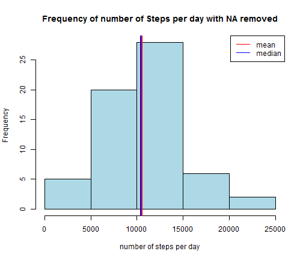

```r
opts_chunk$set(echo=TRUE, results="asis")
```

## Preliminary Steps : Configuration of execution envirronment

Set aspects of the locale for the R process.

```r
Sys.setlocale(category = "LC_ALL", locale = "English")
```

```
## [1] "LC_COLLATE=English_United States.1252;LC_CTYPE=English_United States.1252;LC_MONETARY=English_United States.1252;LC_NUMERIC=C;LC_TIME=English_United States.1252"
```

Initialisation of seed for Random Number Generation

```r
set.seed(1024)
```

Get information from execution envirronment

```r
sessionInfo()
```

```
## R version 3.1.1 (2014-07-10)
## Platform: x86_64-w64-mingw32/x64 (64-bit)
## 
## locale:
## [1] LC_COLLATE=English_United States.1252 
## [2] LC_CTYPE=English_United States.1252   
## [3] LC_MONETARY=English_United States.1252
## [4] LC_NUMERIC=C                          
## [5] LC_TIME=English_United States.1252    
## 
## attached base packages:
## [1] stats     graphics  grDevices utils     datasets  methods   base     
## 
## other attached packages:
## [1] lattice_0.20-29 plyr_1.8.1      xtable_1.7-4    knitr_1.9      
## 
## loaded via a namespace (and not attached):
## [1] codetools_0.2-8 digest_0.6.8    evaluate_0.6    formatR_1.1    
## [5] grid_3.1.1      Rcpp_0.11.4     stringr_0.6.2   tools_3.1.1
```

Loading libraries utils

```r
library(knitr)
library(plyr)
library(xtable)
library(datasets)
library(lattice)
```

## Loading and preprocessing the data

First of all, we have to download data file and unzip the data zip file.

```r
download.file("https://d396qusza40orc.cloudfront.net/repdata%2Fdata%2Factivity.zip", "./ProjectData/activity.zip")
```

```
## Error in download.file("https://d396qusza40orc.cloudfront.net/repdata%2Fdata%2Factivity.zip", : schéma URL non supporté
```

```r
unzip("./ProjectData/activity.zip", files = NULL, list = FALSE, 
      overwrite = TRUE, junkpaths = FALSE, exdir = "./ProjectData", 
      unzip = "internal", setTimes = FALSE)
```

Now we read the CSV file

```r
dfActivity <- read.csv("./ProjectData/activity.csv", sep=",", header=TRUE, fill = TRUE, quote = "\"",na.strings = "NA")
```

Check the content loaded

```r
xt <- xtable(head(dfActivity,5))
print(xt, type='html')
```

<!-- html table generated in R 3.1.1 by xtable 1.7-4 package -->
<!-- Thu Apr 16 22:56:59 2015 -->
<table border=1>
<tr> <th>  </th> <th> steps </th> <th> date </th> <th> interval </th>  </tr>
  <tr> <td align="right"> 1 </td> <td align="right">  </td> <td> 2012-10-01 </td> <td align="right">   0 </td> </tr>
  <tr> <td align="right"> 2 </td> <td align="right">  </td> <td> 2012-10-01 </td> <td align="right">   5 </td> </tr>
  <tr> <td align="right"> 3 </td> <td align="right">  </td> <td> 2012-10-01 </td> <td align="right">  10 </td> </tr>
  <tr> <td align="right"> 4 </td> <td align="right">  </td> <td> 2012-10-01 </td> <td align="right">  15 </td> </tr>
  <tr> <td align="right"> 5 </td> <td align="right">  </td> <td> 2012-10-01 </td> <td align="right">  20 </td> </tr>
   </table>

Format the column date into a correct format

```r
dfActivity$newdate <- strptime(as.character(dfActivity$date), "%Y-%m-%d")
dfActivity$txtdate <- format(dfActivity$newdate, "%d/%m/%Y")
```


## What is mean total number of steps taken per day?

Calculate the total number of steps taken per day

```r
dfActAgg <- aggregate(data.frame(sumSteps = dfActivity$steps),
                      by=list(ActivityDate=dfActivity$date),
                      FUN=sum, 
                      na.rm=TRUE)
```

Check the result of calculation

```r
xt <- xtable(head(dfActAgg,5))
print(xt, type='html')
```

<!-- html table generated in R 3.1.1 by xtable 1.7-4 package -->
<!-- Thu Apr 16 22:57:01 2015 -->
<table border=1>
<tr> <th>  </th> <th> ActivityDate </th> <th> sumSteps </th>  </tr>
  <tr> <td align="right"> 1 </td> <td> 2012-10-01 </td> <td align="right">   0 </td> </tr>
  <tr> <td align="right"> 2 </td> <td> 2012-10-02 </td> <td align="right"> 126 </td> </tr>
  <tr> <td align="right"> 3 </td> <td> 2012-10-03 </td> <td align="right"> 11352 </td> </tr>
  <tr> <td align="right"> 4 </td> <td> 2012-10-04 </td> <td align="right"> 12116 </td> </tr>
  <tr> <td align="right"> 5 </td> <td> 2012-10-05 </td> <td align="right"> 13294 </td> </tr>
   </table>


Draw the histogram of the total number of steps taken each day and add the mean to the plot.


```r
hist(dfActAgg$sumSteps,
     xlab = 'number of steps per day',
     ylab = 'Frequency',
     main = 'Frequency of number of Steps per day',
     col='lightblue')
abline(v = mean(dfActAgg$sumSteps), col = "red", lwd = 2)
abline(v = median(dfActAgg$sumSteps), col = "blue", lwd = 2)
legend("topright", c("mean", "median"), lty = c(1, 1), col = c("red", "blue"))
```

 

Calculate and report the mean and median of the total number of steps taken per day


```r
dfActAggMean <- aggregate(data.frame(meanSteps = dfActivity$steps),
                      by=list(ActivityDate=dfActivity$date),
                      FUN=mean, 
                      na.rm=TRUE)

dfActAggMedian <- aggregate(data.frame(medianSteps = dfActivity$steps),
                      by=list(ActivityDate=dfActivity$date),
                      FUN=median, 
                      na.rm=TRUE)

meanActivity <- mean(dfActAggMean$meanSteps, na.rm = TRUE)

medianActivity <- median(dfActAggMedian$medianSteps, na.rm = TRUE)
```

* Mean of activity : 37.3825996

* Median of activity : 0


## What is the average daily activity pattern?

Make a time series plot (i.e. type = "l") of the 5-minute interval (x-axis) and the average number of steps taken, averaged across all days (y-axis)


```r
dfActAggInt <- aggregate(data.frame(meanSteps = dfActivity$steps),
                      by=list(ActivityInterval=dfActivity$interval),
                      FUN=mean, 
                      na.rm=TRUE)


plot( 
  x=dfActAggInt$ActivityInterval,
  y=dfActAggInt$meanSteps,
  col="dark blue", 
  type="l",
  main="Average number of steps taken across all days",
  ylab="Mean of Step",
  xlab="Interval") 
abline(v = dfActAggInt[dfActAggInt$meanSteps==max(dfActAggInt$meanSteps),"ActivityInterval"], col = "red", lwd = 2)
legend("topright", c("max"), lty = c(1), col = c("red"))
```

 

Which 5-minute interval, on average across all the days in the dataset, contains the maximum number of steps?


```r
dfActAggInt[dfActAggInt$meanSteps==max(dfActAggInt$meanSteps),"ActivityInterval"]
```

```
## [1] 835
```

## Imputing missing values

Calculate and report the total number of missing values in the dataset (i.e. the total number of rows with NAs)


```r
nrow(dfActivity[is.na(dfActivity$steps),])
```

```
## [1] 2304
```

```r
nrow(dfActivity[is.na(dfActivity$date),])
```

```
## [1] 0
```

```r
nrow(dfActivity[is.na(dfActivity$interval),])
```

```
## [1] 0
```

```r
dfActNA<-dfActivity[is.na(dfActivity$steps),]

dfActAggCountNA <- count(dfActNA, c('date'))

dfActAggCountAll <- count(dfActivity, c('date'))

dfActAggCount  <- merge(x = dfActAggCountNA, y = dfActAggCountAll, by = "date", all.y = TRUE)

dfActAggCount <- rename(dfActAggCount, c("freq.x"="nbNA", "freq.y"="nbAll"))
```

Devise a strategy for filling in all of the missing values in the dataset. The strategy does not need to be sophisticated. For example, you could use the mean/median for that day, or the mean for that 5-minute interval, etc.


```r
runApplyMean <- function(xact) { 
    if(is.na(xact)==TRUE) { 
        t<- meanActivity 
      } 
    else { 
        t<-xact 
      } 
    t
  }

dfTinyActivity <- dfActivity

for(i in seq_along(dfTinyActivity$steps)) {
dfTinyActivity$steps[i] <- runApplyMean(dfTinyActivity[i,"steps"])  
  }
```

Make a histogram of the total number of steps taken each day and Calculate and report the mean and median total number of steps taken per day. Do these values differ from the estimates from the first part of the assignment? What is the impact of imputing missing data on the estimates of the total daily number of steps?


```r
dfTinyActAgg <- aggregate(data.frame(sumSteps = dfTinyActivity$steps),
                      by=list(ActivityDate=dfTinyActivity$date),
                      FUN=sum)

hist(dfTinyActAgg$sumSteps,
     xlab = 'number of steps per day',
     ylab = 'Frequency',
     main = 'Frequency of number of Steps per day with NA removed',
     col='lightblue')
abline(v = mean(dfTinyActAgg$sumSteps), col = "red", lwd = 2)
abline(v = median(dfActAgg$sumSteps), col = "blue", lwd = 2)
legend("topright", c("mean", "median"), lty = c(1, 1), col = c("red", "blue"))
```

 

```r
dfTinyActAggMean <- aggregate(data.frame(meanSteps = dfTinyActivity$steps),
                      by=list(ActivityDate=dfTinyActivity$date),
                      FUN=mean, 
                      na.rm=TRUE)

dfTinyActAggMedian <- aggregate(data.frame(medianSteps = dfTinyActivity$steps),
                      by=list(ActivityDate=dfTinyActivity$date),
                      FUN=median, 
                      na.rm=TRUE)

meanTinyActivity <- mean(dfActAggMean$meanSteps, na.rm = TRUE)

medianTinyActivity <- median(dfActAggMedian$medianSteps, na.rm = TRUE)
```

* Mean of activity after suppress NA : 37.3825996

* Median of activity after suppress NA : 0

## Are there differences in activity patterns between weekdays and weekends?

Create a new factor variable in the dataset with two levels - "weekday" and "weekend" indicating whether a given date is a weekday or weekend day.


```r
dfTinyActivity$weekday <- as.factor(
                              ifelse((   
                                  weekdays(dfTinyActivity$newdate)=="Saturday"
                                | weekdays(dfTinyActivity$newdate)=="Sunday")
                                  ,"weekend", "weekday" ))
```

Make a panel plot containing a time series plot (i.e. `type = "l"`) of the 5-minute interval (x-axis) and the average number of steps taken, averaged across all weekday days or weekend days (y-axis).


```r
dfTinyActAggMeanPlot <- aggregate(data.frame(Numberofsteps = dfTinyActivity$steps),
                      by=list(ActWeekDay=dfTinyActivity$weekday, 
                              Interval=dfTinyActivity$interval),
                      FUN=mean, 
                      na.rm=TRUE)

xyplot( Numberofsteps ~  Interval | ActWeekDay, data = dfTinyActAggMeanPlot,layout=c(1, 2), type="l")
```

 
